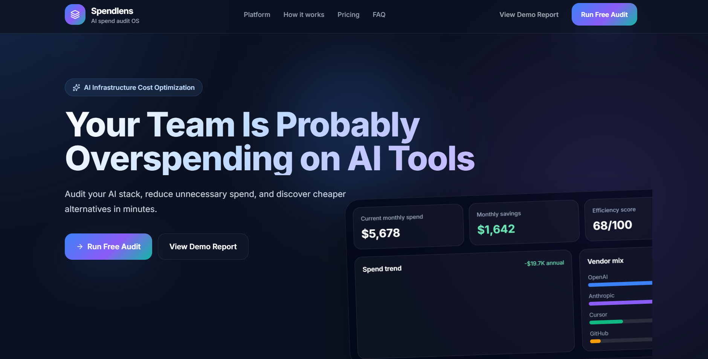
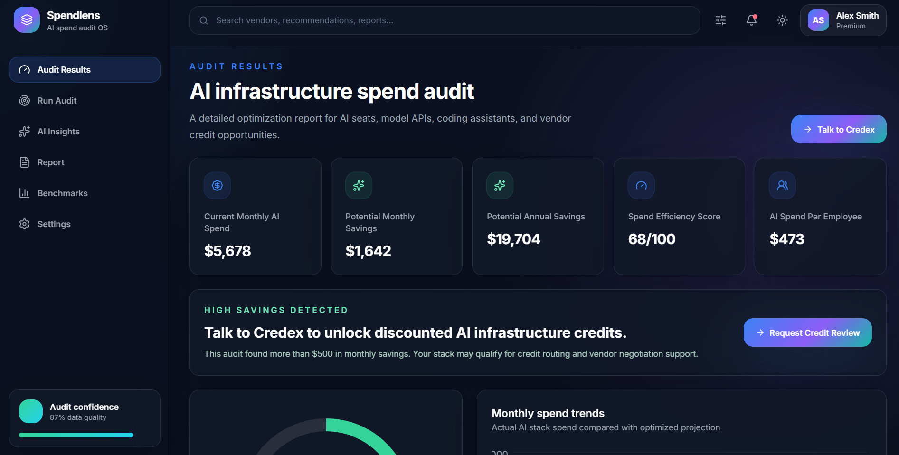
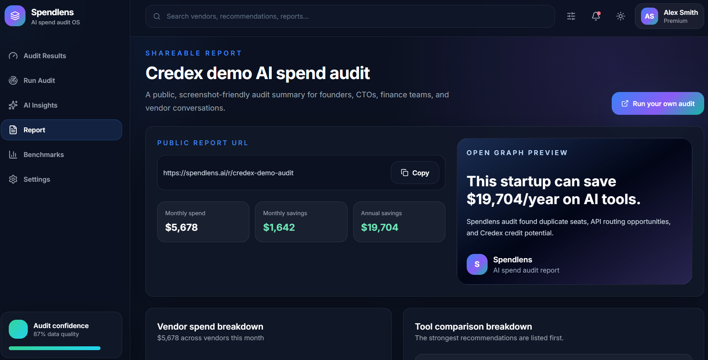

# Spendlens

Spendlens is a B2B SaaS AI infrastructure spend audit platform for startup founders, CTOs, and engineering managers. It helps teams enter their current AI tools, plans, seats, and spend, then produces a finance-literate audit showing overspending, downgrade opportunities, API routing ideas, and Credex credit opportunities.

## Live Links

- Deployed frontend: https://spend-lens-steel.vercel.app/
- Deployed backend: https://spendlens-akxc.onrender.com
- GitHub repo: https://github.com/Yashyadav1223/SpendLens

## Screenshots

### Landing page



### Audit results dashboard



### Shareable audit report



## Tech Stack

- Frontend: React, Vite, Tailwind CSS, React Router, Recharts, Framer Motion, Lucide React
- Backend: Node.js, Express, TypeScript, Zod, Vitest, express-rate-limit
- Storage: Supabase PostgreSQL
- Email: Resend
- AI summary: Gemini API primary, Claude fallback, deterministic template fallback

## Quick Start

Run the backend:

```bash
cd backend
npm install
cp .env.example .env
npm run dev
```

Run the frontend:

```bash
cd frontend
npm install
cp .env.example .env
npm run dev
```

Open:

```txt
http://localhost:5173
```

## Environment Variables

Backend:

```env
PORT=8080
CORS_ORIGIN=http://localhost:5173
CLIENT_BASE_URL=http://localhost:5173
SUPABASE_URL=your_supabase_project_url
SUPABASE_SERVICE_ROLE_KEY=your_supabase_service_role_secret
RESEND_API_KEY=your_resend_key
RESEND_FROM_EMAIL=Spendlens <audit@yourdomain.com>
GEMINI_API_KEY=your_gemini_key
GEMINI_MODEL=gemini-2.5-flash
ANTHROPIC_API_KEY=optional_anthropic_key
ANTHROPIC_MODEL=claude-3-5-sonnet-latest
```

Frontend:

```env
VITE_API_BASE_URL=http://localhost:8080
```

## API Overview

- `POST /api/audit` - creates deterministic AI spend audit results
- `POST /api/summary` - generates an AI summary with fallback behavior
- `POST /api/leads` - captures and stores leads in Supabase
- `POST /api/report` - creates a shareable public report
- `GET /api/report/:id` - returns a public report without private lead details
- `GET /health` - health check

## Tests

```bash
cd backend
npm run test
```

Current backend tests cover audit recommendations, savings calculations, optimized-stack scenarios, invoice reconciliation, unknown-tool behavior, and audit API validation.

## Deployment

Frontend can deploy to Vercel:

```bash
cd frontend
npm run build
```

Backend can deploy to Render or Railway:

```bash
cd backend
npm run build
npm run start
```

Make sure production environment variables are set in the hosting dashboard. Do not commit secrets.

## Decisions

1. I used deterministic audit rules instead of AI for pricing recommendations because financial calculations need to be repeatable, testable, and explainable.
2. I centralized vendor pricing in one backend data file so every savings number traces back to `PRICING_DATA.md`.
3. I used Gemini as the primary AI summary provider because it is easier to access for demos, with Claude and template fallbacks for reliability.
4. I captured leads only after showing audit value because the assignment emphasizes value-first conversion instead of gating the tool too early.
5. I kept the backend as a modular monolith rather than microservices because this is an MVP where speed, clarity, and deployability matter more than distributed complexity.

## Current Status

The MVP includes the landing page, spend input form, deterministic audit engine, audit results dashboard, AI summary service, Supabase lead/report storage, shareable report endpoints, pricing documentation, and automated backend tests. Screenshots, final deployed URLs, and real user interview notes should be added before submission.
